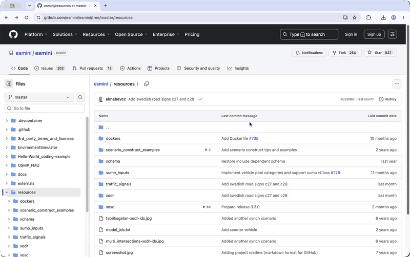

#  drawtonomy

<h3 align="center">
  シーンを描く。シナリオを走らせる。🚗
</h3>

<p align="center">
  無料のブラウザ完結型、運転シナリオ用ホワイトボード。<br />
  インストールもアカウント登録も不要です。
</p>

<h4 align="center">
  🎬 <a href="https://drawtonomy.com/?open=https://github.com/esmini/esmini/blob/master/resources/xosc/acc-test.xosc">シナリオを再生してみる</a> |
  🎨 <a href="https://drawtonomy.com">今すぐ描く</a> |
  📖 <a href="https://docs.drawtonomy.com/ja/">ドキュメント</a> |
  💬 <a href="https://github.com/kosuke55/drawtonomy/issues">Issues</a>
</h4>

<p align="center">
  
</p>

drawtonomy には二つの顔があります。

- **🎨 シーンモード**：レーンも車両も交差点も、繋がりを保ったまま描ける図形です。図として SVG や PDF に、マップとして OpenDRIVE や Lanelet2 に書き出せます。
- **🎬 シナリオモード**：描いたシーンにイベントとトリガーを与えて再生ボタンを押すだけ。[esmini](https://github.com/esmini/esmini) が WebAssembly でブラウザ内実行し、PASS / FAIL まで判定します。

## 🎨 シーンモード

- **[レーンの接続](https://docs.drawtonomy.com/ja/guides/lane-connections/)** — 接続関係を保ったまま編集できます
- **[レーンツール](https://docs.drawtonomy.com/ja/guides/lane-tool/)** — センターラインをクリックするだけ
- **[地図からレーンを生成](https://docs.drawtonomy.com/ja/guides/lane-from-map/)** — 衛星写真から実際の道路をトレース
- **[交差点・ラウンドアバウト](https://docs.drawtonomy.com/ja/guides/intersections/)** — テンプレートでワンクリック配置
- **[運転シーン向けテンプレート](https://docs.drawtonomy.com/ja/guides/participants/)** — 車両・歩行者・標識など
- **[スナップとポイント共有](https://docs.drawtonomy.com/ja/guides/snap/)** — ジオメトリの接続を自動維持
- **[パスフットプリント](https://docs.drawtonomy.com/ja/guides/path-footprint/)** — パスに沿って自動配置
- **[数式ツール](https://docs.drawtonomy.com/ja/guides/math-equations/)** — LaTeX の組版もキャンバス上に
- **[`.drawtonomy.svg`](https://docs.drawtonomy.com/ja/reference/drawtonomy-svg/)** — 開けば接続関係もそのまま復元

📖 **[デモ動画で見る機能ツアー](docs/feature-tour.md)** ·
[docs.drawtonomy.com](https://docs.drawtonomy.com/ja/)

## 🎬 シナリオモード

まっさらなシーンから、あるいは読み込んだシナリオから、イベントとトリガーを組み立てて OpenSCENARIO のストーリーボードを自分の手で作れます。

- **[ビジュアルオーサリング](https://docs.drawtonomy.com/ja/scenario/first-scenario/)** — フェーズ・イベント・アクション・トリガーを組み立て
- **[開いて編集](https://docs.drawtonomy.com/ja/scenario/open-and-play/)** — `.xosc` はファイルでも GitHub の URL でも開いてそのまま編集可能
- **[再生機能](https://docs.drawtonomy.com/ja/scenario/playback/)** — シーク・Follow Ego・ゴーストトレイル・`.webm` 書き出し
- **[PASS / FAIL 判定](https://docs.drawtonomy.com/ja/scenario/end-and-fail-conditions/)** — 実行のたびに判定
- **[esmini 対応 zip](https://docs.drawtonomy.com/ja/guides/export-asam/)** — `.xodr` + `.xosc` を書き出し

GitHub 上の公開 `.xosc` はワンクリックで再生できます:
**[シナリオを再生してみる](https://drawtonomy.com/?open=https://github.com/esmini/esmini/blob/master/resources/xosc/acc-test.xosc)**。
[**drawtonomy for GitHub**](https://docs.drawtonomy.com/ja/integrations/github-extension/)
拡張を使えば、シナリオは GitHub 上の置かれた場所でそのまま再生されます:

<p align="center">
  
</p>

## 🔄 対応フォーマット

OpenDRIVE、Lanelet2、OpenSCENARIO、ROS マップ、SVG/PDF などの図版まで対応。
→ [フォーマット表を見る](docs/feature-tour.md#-exportimport) ·
[エクスポート形式リファレンス](https://docs.drawtonomy.com/ja/reference/export-formats/)

## 🤖 AI・自動化

- **[AI Scene Generator](extensions/ai-scene-generator/)** — 自然言語や OpenSCENARIO XML からシーンを生成 — by [@vishwesh5](https://github.com/vishwesh5)
- **[MCP Server](https://www.npmjs.com/package/@drawtonomy/mcp-server)** — AI エージェントにシーンを描かせる
- **[Headless SDK](https://www.npmjs.com/package/@drawtonomy/sdk)** — ブラウザなしで Node.js からシーンを生成・書き出し

## 🔒 プライバシー

ブラウザだけで完結します。バックエンドもアカウントもテレメトリもなく、
esmini のシナリオエンジンもローカルで WebAssembly として動作します。
([詳細](https://docs.drawtonomy.com/ja/security/))

## 🧩 拡張して使う

iframe ベースの拡張システムを、SDK と postMessage API で構築できます:

```bash
pnpm add -g @drawtonomy/dev-server
drawtonomy-dev-server
# 続けて http://localhost:3000/?ext=http://localhost:3001/manifest.json を開く
```

📖 [drawtonomy を拡張する](https://docs.drawtonomy.com/ja/extend/) ·
[拡張開発ガイド](docs/extensions.ja.md) ·
[エクスポーター開発ガイド](docs/exporter.ja.md)

## 📚 その他

- 🎞️ [機能ツアー](docs/feature-tour.md)
- ⌨️ [キーボードショートカット](https://docs.drawtonomy.com/ja/reference/shortcuts/)
- ⚖️ [他ツールとの比較](https://docs.drawtonomy.com/ja/compare/)
- 💡 [活用事例](https://docs.drawtonomy.com/ja/use-cases/)
- ❓ [FAQ](https://docs.drawtonomy.com/ja/faq/)

<sub>[English](README.md)</sub>
