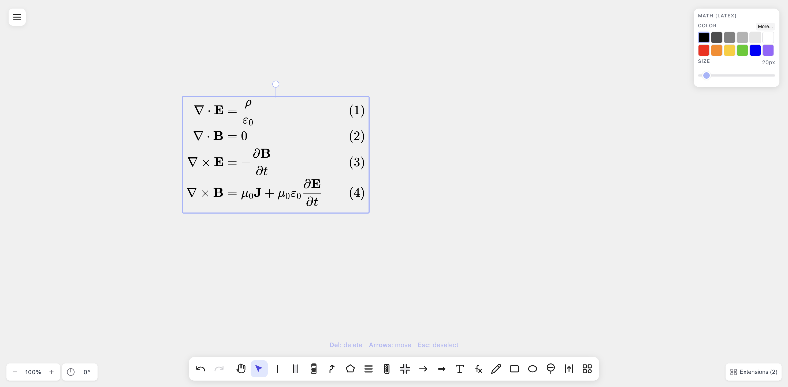
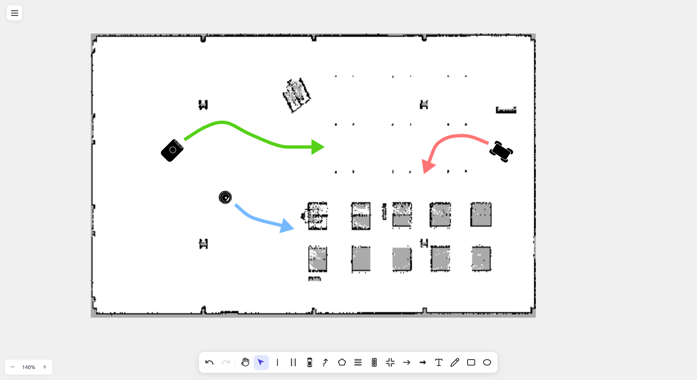

# 🎞️ Feature tour

A video tour of drawtonomy's features, one clip per feature.
For step-by-step instructions and the full reference, the canonical
documentation lives at [docs.drawtonomy.com](https://docs.drawtonomy.com) —
each section below links to its docs page.

## 🛣️ Lane Connection Management

Edit with understanding of lane relationships. Moving boundaries auto-transforms connected lanes. Set direction and adjacency with Next/Previous/Left/Right Lane.
→ [Lane connections](https://docs.drawtonomy.com/guides/lane-connections/)

<video src="https://github.com/user-attachments/assets/c353f969-55cc-4968-b300-a8a5242034fe" width="80%" controls></video>

## ⚡ Lane Tool

Auto-generate left and right boundaries by clicking the centerline. Efficiently create multiple lanes by specifying width, and draw connected lanes continuously. You can also create lanes by selecting two existing Linestrings.
→ [Lane tool](https://docs.drawtonomy.com/guides/lane-tool/)

<video src="https://github.com/user-attachments/assets/366cf6f2-1806-48cd-aab2-ce52596293b0" width="80%" controls></video>

Smooth lane boundaries with one click from the Attribute Panel.
→ [Smooth lanes](https://docs.drawtonomy.com/guides/smooth-lanes/)

<video src="https://github.com/user-attachments/assets/2f38637e-59e6-4e63-9126-f3b6dd05f143" width="80%" controls></video>

## 🛰️ Lane Generator (Satellite Map → Lane)

Switch on the road or satellite map background, then click a road to generate a single lane, or drag to enclose a region and generate every road inside it. OSM road data is fetched and converted into editable Lane shapes aligned to the map.
→ [Lanes from a map](https://docs.drawtonomy.com/guides/lane-from-map/)

<video src="https://github.com/user-attachments/assets/1239b952-211e-418a-840a-fbe9b6c3a0f0" width="80%" controls></video>

## ➕ Intersection

Place complex intersection structures with templates in one click.

<video src="https://github.com/user-attachments/assets/fdc4a482-e89b-4386-9cdf-0fa2cd978fd7" width="80%" controls></video>

## 🚙 Rich Drawing Tools & Templates

Drawing tools and shape templates for easily expressing autonomous driving scenarios. You can also [add custom SVG templates](../templates/TEMPLATE_GUIDE.md) via PR.
→ [Shape catalog](https://docs.drawtonomy.com/reference/shapes/)

**🚗 Autonomous Driving Focused:**

- Linestring (continuous lines for lane boundaries, etc.)
- Lane
- Participants — Vehicle (Sedan, Bus, Truck, Motorcycle templates) and Pedestrian (Walking, Simple templates)
- Path (Arrow style, Band style)
- Polygon
- Crosswalk
- TrafficLight (vehicle and pedestrian signals)
- TrafficSign
- RoadMarking
- Intersection
- Others (additional road/scene templates)

**✏️ Basic Shapes:**

- LineArrow
- Arrow
- Text
- Freehand
- Rectangle
- Ellipse
- Image

## 🧲 Snap Function

Auto-snaps to existing points and lines. Hold Shift while drawing to temporarily disable snapping.
→ [Snap](https://docs.drawtonomy.com/guides/snap/)

<video src="https://github.com/user-attachments/assets/5b595d73-4ed6-4644-a36e-1cfd3e44c61d" width="80%" controls></video>

## 🔗 Point Sharing

Hold Alt(Option) and click to share existing points and connect Linestring, Polygon, and Path.
→ [Point sharing](https://docs.drawtonomy.com/guides/point-sharing/)

<video src="https://github.com/user-attachments/assets/cdaa0d35-c40e-4a00-b90e-a1c0e48773fa" width="80%" controls></video>

## 🎨 Style Customization

Set color, opacity, width, and style individually. Change default values from the hamburger menu.
→ [Styling](https://docs.drawtonomy.com/guides/styling/)

<video src="https://github.com/user-attachments/assets/75760e80-9c18-4ed6-8d8f-39ed14708482" width="80%" controls></video>

## ✏️ Segment Editing

Double-click Linestring, Lane, or Polygon to select and edit segments (between two points). Click on a segment to add new points for fine shape adjustments.
→ [Segment editing](https://docs.drawtonomy.com/guides/segment-editing/)

<video src="https://github.com/user-attachments/assets/97fa923f-6bfb-4bb0-86ff-ef0ebb05a9d2" width="80%" controls></video>

## 👣 Path Footprint

Generate footprints on a Path with the Generate button. Rectangle or any vehicle template (Sedan, Bus, Truck, etc.) can be set as footprints. Changing the style of one footprint syncs to all — color, template, opacity, and size changes are applied to every footprint simultaneously while maintaining equal intervals. Footprint orientation is automatically calculated from the Path direction, including smooth curves. The Anchor Offset slider lets you shift the reference point along the travel direction — for example, aligning to the base link or front bumper position instead of the center.
→ [Path footprint](https://docs.drawtonomy.com/guides/path-footprint/)

<video src="https://github.com/user-attachments/assets/c6633f7d-f596-4a25-9858-93e6324835ff" width="80%" controls></video>

## 🧮 Math Tool (LaTeX)

Place typeset LaTeX equations anywhere on the canvas with the `fx` tool. The source stays editable and renders with KaTeX, so you can write anything from a simple formula to full multi-line systems.
→ [Math equations](https://docs.drawtonomy.com/guides/math-equations/)

  

## 📦 Export/Import

| Format | Import | Export | Note |
| ------ | :----: | :----: | ---- |
| **OpenDRIVE (.xodr)** | ✓ | ✓ | ASAM 1.8 — high-fidelity round-trips, verified in esmini ([import](https://docs.drawtonomy.com/guides/import-opendrive/) / [export](https://docs.drawtonomy.com/guides/export-asam/)) |
| **OpenSCENARIO (.xosc)** | ✓ | ✓ | ASAM 1.3 — open, play, author, export ([play](https://docs.drawtonomy.com/scenario/open-and-play/)) |
| **esmini bundle (.zip)** | | ✓ | `.xodr` + `.xosc` together |
| **Lanelet2 (.osm)** | ✓ | ✓ | round-trips preserve original IDs and tags ([import](https://docs.drawtonomy.com/guides/import-lanelet2/)) |
| **ROS OccupancyGrid (.pgm + .yaml)** | ✓ | | SLAM maps from nav2, cartographer, … ([import](https://docs.drawtonomy.com/guides/import-ros-map/)) |
| **drawtonomy.svg** | ✓ | ✓ | re-editable native format |
| **SVG / PNG / JPG / PDF / EPS** | | ✓ | figures for papers and slides ([all formats](https://docs.drawtonomy.com/reference/export-formats/)) |

Both map formats land in the same internal lane model, so drawtonomy also works
as an **OpenDRIVE ⇄ Lanelet2 bridge**: import one, edit visually, export the
other ([guide](https://docs.drawtonomy.com/guides/convert-opendrive-lanelet2/)).

> **Note on EPS export**: EPS format does not support transparency. When exporting shapes with opacity settings, the exported EPS will show shapes at full opacity, which may differ from the canvas display. For accurate transparency rendering, use PDF export instead.

<video src="https://github.com/user-attachments/assets/66365b83-4d74-4502-a204-cd9e09ae292b" width="80%" controls></video>

### [Lanelet2](https://github.com/fzi-forschungszentrum-informatik/Lanelet2) Import / Export

**Import** Lanelet2 OSM format maps for editing. Load the whole map, or pick out only the lanes you need before importing — handy for working on a small part of a large map. Sample maps: [Autoware Documentation](https://autowarefoundation.github.io/autoware-documentation/main/demos/planning-sim/#download-the-sample-map).
→ [Import Lanelet2](https://docs.drawtonomy.com/guides/import-lanelet2/)

**Export** the lanes you draw back out as a Lanelet2 OSM map via the **`.osm (Lanelet2)`** menu item. Lane boundaries become `way` linestrings and each lane becomes a `relation type=lanelet` referencing its left/right boundary ways, so the result round-trips back into drawtonomy (or any Lanelet2-aware tool). Maps imported from OSM preserve their original IDs and tags on re-export. The exporter is implemented in `@drawtonomy/sdk` — see the [Exporter Developer Guide](./exporter.md).

<video src="https://github.com/user-attachments/assets/92cf1c66-b7d4-4142-b637-7dd9eb0a156f" width="80%" controls></video>

<video src="https://github.com/user-attachments/assets/652af370-8bb6-4da4-8a5b-a798b59cf7f5" width="80%" controls></video>

### OpenDRIVE (.xodr) Import / Export

**Import** ASAM OpenDRIVE (.xodr) maps for editing. As with Lanelet2, load the whole map or select only the lanes you need. Plan-view geometry (line / arc / clothoid) is evaluated analytically and lane/junction connectivity is rebuilt.
→ [Import OpenDRIVE](https://docs.drawtonomy.com/guides/import-opendrive/)

**Export** your scene back out as an OpenDRIVE map. Lane types, road marks, and junction connectivity are preserved for high-fidelity round-trips, verified by playback in esmini 3.3.0. Implemented in `@drawtonomy/sdk` — see the [Exporter Developer Guide](./exporter.md).

<video src="https://github.com/user-attachments/assets/84e16e91-e267-433b-9bd8-94eecf3124a8" width="80%" controls></video>

### ROS OccupancyGrid Map Import

Import SLAM-generated maps from ROS `map_server` format (.pgm + .yaml). Select both files together in the file dialog. The map is automatically colored (occupied=black, free=white, unknown=gray) and scaled to match lane dimensions.
→ [Import a ROS map](https://docs.drawtonomy.com/guides/import-ros-map/)

- `.pgm` + `.yaml` → Uses YAML settings (resolution, thresholds)
- `.pgm` only → Uses defaults (resolution=0.05 m/px)

Compatible with nav2, cartographer, gmapping, and other SLAM tools.

  

### ASAM Export (OpenDRIVE / OpenSCENARIO / esmini)

Export the current scene as an ASAM-format file or a single zip bundle ready for [esmini](https://github.com/esmini/esmini) to play back. Use the **Export for esmini** menu item to produce a zip containing both `.xodr` and `.xosc`.
→ [Export to ASAM formats](https://docs.drawtonomy.com/guides/export-asam/)

The exporter is implemented in `@drawtonomy/sdk` and is the main extension point for adding new shapes, animation features, or entirely new target formats (CARLA, Unity, SUMO, …).

The clip below is a single round-trip: draw an intersection, draw a path, generate footprints, export the esmini zip, then play the exported `.xosc` back in esmini — the vehicle follows the trajectory built from the path.

<video src="https://github.com/user-attachments/assets/1a32b360-5ffc-4967-9c28-e424c1f47aaf" width="80%" controls></video>

📖 **[Exporter Developer Guide](./exporter.md)** | [日本語](./exporter.ja.md) | 🧪 **[Exporter Playground extension](../extensions/exporter-playground/)** for canvas-driven verification

## 🎬 Scenario Playback

Drop an OpenSCENARIO `.xosc` together with its OpenDRIVE `.xodr` onto the canvas and the storyboard plays back in the browser — seek the timeline, follow the ego vehicle, show ghost trails, and export the run as `.webm`.
→ [Playback](https://docs.drawtonomy.com/scenario/playback/)

The simulation core is [esmini](https://github.com/esmini/esmini) compiled to WebAssembly, used here under [MPL-2.0](https://github.com/esmini/esmini/blob/master/LICENSE) with all credit for the OpenSCENARIO 1.x runtime going to the esmini maintainers.

<video src="https://github.com/user-attachments/assets/98c85e84-b4a3-408e-afa4-f7a6961b345d" width="80%" controls></video>

## 🤖 [AI Scene Generator](../extensions/ai-scene-generator/)

Generate editable driving scenes on the canvas from natural language descriptions, OpenSCENARIO XML, or DSL input. AI automatically interprets the scenario and places lanes, vehicles, pedestrians, and other elements as fully editable shapes. Supports Anthropic Claude, OpenAI GPT, and Google Gemini as AI providers. Open from the **Extensions** button at the bottom-right of the canvas.
→ [AI scene tutorial](https://docs.drawtonomy.com/tutorials/ai-scene/)

### Natural Language

> *Prompt: "A 3-lane highway going left-to-right. An ego sedan (blue) in the center lane, a truck (grey) in the right lane slightly ahead. Show a dashed path for the ego vehicle changing to the left lane."*

<video src="https://github.com/user-attachments/assets/16cb1980-c912-44f0-a606-de2b50d46287" width="80%" controls></video>

### OpenSCENARIO

Generated from [ASAM OpenSCENARIO DSL - Euro NCAP scenario example](https://publications.pages.asam.net/standards/ASAM_OpenSCENARIO/ASAM_OpenSCENARIO_DSL/latest/annexes/examples.html#_euro_ncap):

<video src="https://github.com/user-attachments/assets/ffcf0cff-11bf-406c-a3cb-9af49994015e" width="80%" controls></video>

**Contributors:** [@vishwesh5](https://github.com/vishwesh5)

## ⌨️ Keyboard Shortcuts

→ [Full shortcut reference](https://docs.drawtonomy.com/reference/shortcuts/)

### Tool Switching

| Key  | Function                           |
| ---- | ---------------------------------- |
| M    | Hand (pan tool)                    |
| V    | Select tool                        |
| L    | Create Linestring                  |
| N    | Create Lane                        |
| P    | Participants (Vehicle/Pedestrian)  |
| H    | Create Path                        |
| G    | Create Polygon                     |
| X    | Create Crosswalk                   |
| Y    | Create Traffic Sign                |
| R    | Create Road Marking                |
| O    | Create Others (road/scene templates) |
| I    | Create Intersection                |
| W    | Create LineArrow                   |
| T    | Create Text                        |
| D    | Create Freehand                    |

### Edit Operations

| Key                        | Function                                        |
| -------------------------- | ----------------------------------------------- |
| Ctrl+Z / Cmd+Z             | Undo                                            |
| Ctrl+Shift+Z / Cmd+Shift+Z | Redo                                            |
| Ctrl+C / Cmd+C             | Copy                                            |
| Ctrl+V / Cmd+V             | Paste                                           |
| Delete / Backspace         | Delete                                          |
| Shift                      | Temporarily disable snap (while drawing)        |
| Alt + Click                | Share existing point (Linestring/Polygon/Path)  |
| Double-click               | Segment editing (Linestring/Lane/Polygon)       |
